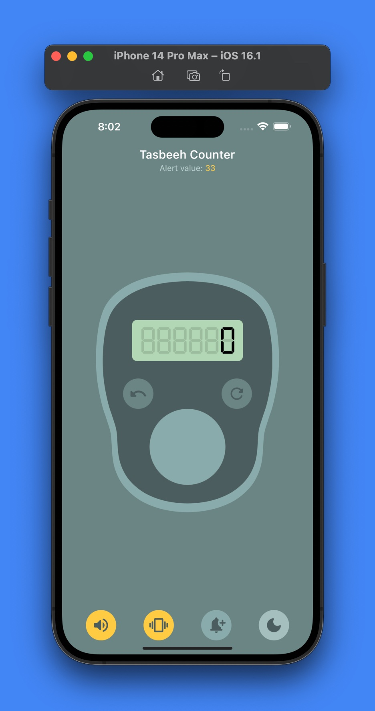

# Tasbeeh Counter

Simple tasbeeh counter app made with Flutter. This project is sort of a copy of [Tasbih Counter Lite: Dhikr App](https://play.google.com/store/apps/details?id=com.sevapp.tasbih_counter_lite_zikir&hl=en&gl=US) (without additional themes option) for learning purposes. My main objectives were learning state management using `riverpod` and `freezed` packages as well as organizing my code using MVVM architecture.

## Preview

### Light Mode

### Dark Mode

## Credits, and Thanks to

- [@maisaanium](https://www.instagram.com/maisaanium/?hl=en) for the beautiful app icon.
- [@killermonk](https://github.com/killermonk) for the code for digital font.
